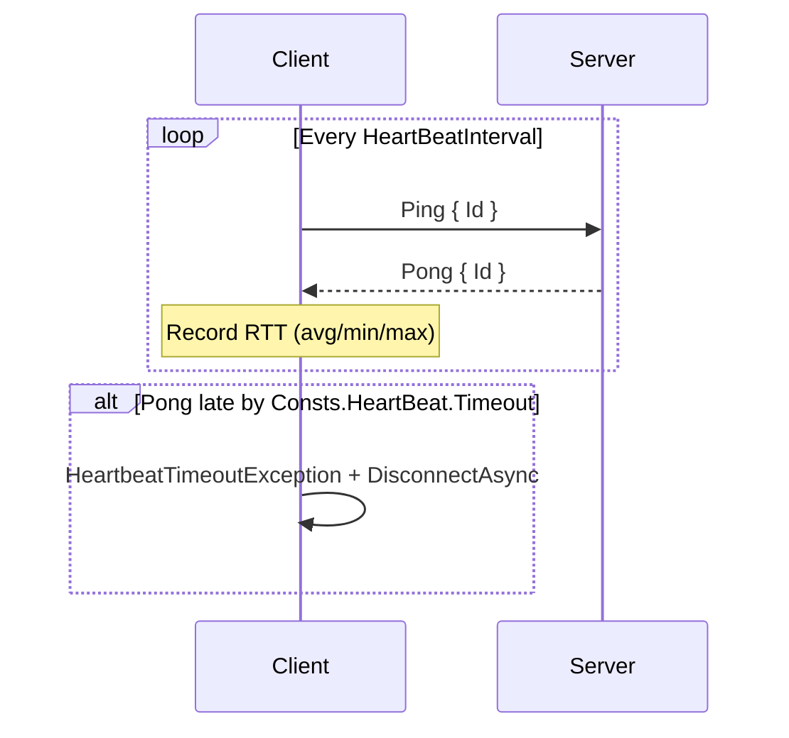
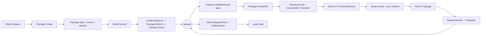

# Protocol Specification

> 中文版: [10.protocol.md](../zh/10.protocol.md)

The GoPlay wire protocol has two layers: an **outer framing** (binary length prefix) and an **inner Header + Body** (Protobuf or Json). This document covers the full frame format and the semantics / byte layout of every PackageType (handshake, heartbeat, chunking, kick, etc.).

Source definitions: [Frameworks/Res/Proto3/protocol.proto](../../Frameworks/Res/Proto3/protocol.proto), [Frameworks/Res/Proto3/basic.proto](../../Frameworks/Res/Proto3/basic.proto).

## Wire Frame Layout

```text
  0   1   2   3   4            4+H          4+H+B
  +---+---+---+---+-----------+------------+
  | outerLen  | headerLen | Header  |  Body  |
  |  (ushort) | (ushort)  | (bytes) | (bytes)|
  +---------+-----------+---------+---------+
                 \_____ innerLen _______/

  outerLen = 2 + headerLen + bodyLen   // excludes the 2-byte outerLen itself
  innerLen = outerLen
  H = headerLen, B = bodyLen
```

- Length fields are **little-endian ushort** (max 65535).
- A single package's `headerLen + bodyLen` must stay within `ushort.MaxValue - 2`. Larger payloads must go through **chunking** (see below).
- Implementation: [Frameworks/Core/Protocols/Package.cs](../../Frameworks/Core/Protocols/Package.cs) (`WriteTo` / `ParseRaw`).

## Header (Protobuf Message)

```proto
message Status {
  StatusCode Code = 1;
  string Message  = 2;
}

message Session {
  string Guid = 1;
  map<string, google.protobuf.Any> Values = 2;
}

message PackageInfo {
  PackageType Type         = 1;
  uint32 Id                = 2;   // client-assigned request id, used to correlate Response
  EncodingType EncodingType = 3;  // 0=Protobuf, 1=Json
  uint32 Route             = 4;   // assigned by the server during handshake
  uint32 ContentSize       = 5;   // body length in bytes (== bodyLen)
  uint32 ChunkCount        = 6;   // total chunks; 0 or 1 means "not chunked"
  uint32 ChunkIndex        = 7;   // current chunk index (0-based)
}

message Header {
  Status Status           = 1;
  Session Session         = 2;
  PackageInfo PackageInfo = 3;
}
```

## PackageType Enum

| Value | Name | Direction | Semantics |
|-------|------|-----------|-----------|
| 0 | `HankShakeReq` | C &#x2192; S | Handshake request |
| 1 | `HankShakeResp` | S &#x2192; C | Handshake response (carries full route map) |
| 2 | `Ping` | S &#x2192; C | Heartbeat request |
| 3 | `Pong` | C &#x2192; S | Heartbeat reply |
| 4 | `Notify` | C &#x2192; S | Client notify, no response expected |
| 5 | `Request` | C &#x2192; S | Client request, awaits Response with matching Id |
| 6 | `Response` | S &#x2192; C | Server reply to Request |
| 7 | `Push` | S &#x2192; C | Server push |
| 8 | `Kick` | S &#x2192; C | Server kicks the client, `Status.Message` carries the reason |

> Request/Notify/Push naming follows Pomelo. The enum spelling `HankShake` is kept for backwards compatibility.

## StatusCode Enum

| Value | Name | Meaning |
|-------|------|---------|
| 0 | `Success` | OK |
| 1 | `Failed` | Business failure, `Status.Message` is the business error code |
| 2 | `Error` | Framework / transport error (NETWORK_ERROR etc.) |
| 3 | `Timeout` | Request timed out (generated locally by client) |

## Handshake Sequence

Handshake is the **first** package after the transport connects. The server replies with the full route map; business `Request("xxx")` calls then resolve route strings through this map.

```mermaid
sequenceDiagram
  participant C as Client
  participant T as Transport
  participant S as Server

  C->>T: ConnectAsync(host, port)
  T-->>C: connected
  C->>S: HankShakeReq { ClientVersion, ServerTag, AppKey }
  S->>S: BuildRouteMap() + Processor.OnHandShake()
  S-->>C: HankShakeResp { ServerVersion, HeartBeatInterval, Routes }
  C->>C: cache Routes map
  Note over C,S: Connected event; business can Request/Notify
```

```proto
message ReqHankShake {
  string ClientVersion = 1;
  ServerTag ServerTag  = 2;
  string AppKey        = 3;
}

message RespHandShake {
  string ServerVersion       = 1;
  uint32 HeartBeatInterval   = 2;   // milliseconds
  map<string, uint32> Routes = 3;   // "processor.method" -> routeId
}
```

- Route strings follow Pomelo's lowercase `"processor.method"` convention. `[Processor("echo")]` + `[Request("request")]` &#x2192; `"echo.request"`.
- Route ids are generated by `IdLoopGenerator.Next()` on the server and may differ per restart - **clients must** always use the handshake's map rather than hardcoding ids.

## Heartbeat Sequence

`HeartBeatInterval` comes from the handshake response (default around 3s). Heartbeats are driven by the **client**:



Implementation: [Frameworks/Client/Client.Heartbeat.cs](../../Frameworks/Client/Client.Heartbeat.cs). `ResolvePong` correlates by `Id`, computes RTT, and updates the stats.

## Kick Frame

Emitted by the server to forcibly close a clientId:

```text
Header.PackageInfo.Type = Kick
Header.Status.Code      = Error / Failed
Header.Status.Message   = "reason string"
Body                    = empty
```

The client fires `OnKicked(reason)` and then `DisconnectAsync()` immediately.

## Chunk / Fragmentation

When a single package exceeds the `ushort.MaxValue` ceiling, `Package.Split()` cuts one logical package into multiple physical frames:

```text
Header.PackageInfo {
  Type        = Request/Response/Push/Notify,
  Id          = same logical id across chunks,
  Route       = same routeId,
  ChunkCount  = N,                // total fragments (> 1 means chunked)
  ChunkIndex  = 0 .. N-1,         // monotonic
}
```

The receiver (client: [Frameworks/Client/Client.Chunk.cs](../../Frameworks/Client/Client.Chunk.cs); server: `Server.Chunk`) buffers by `Id` and dispatches upward only after all `ChunkCount` fragments arrive.

- `ChunkCount <= 1` is treated as **not chunked** - dispatched directly.
- Missing or out-of-order chunks time out via the client `TimeoutLoop`.

## EncodingType

```proto
enum EncodingType {
  Protobuf = 0;
  Json     = 1;
}
```

- **Protobuf** (default): uses Google.Protobuf generator and the `IMessage` interface; the framework takes the `EncodeTo(IBufferWriter<byte>)` zero-alloc hot path.
- **Json**: LitJson-based; handy for debugging or scripting interop, but not the performance path.

Header and body always use the **same** encoding, indicated by `PackageInfo.EncodingType`. Both client and server fix the encoding on the first package and never switch mid-session.

## ServerTag (Cluster Reserved)

```proto
enum ServerTag {
  Empty    = 0;
  FrontEnd = 1;   // connector the client connects to
  BackEnd  = 2;   // internal logic server
  All      = 3;
}
```

Reserved for the future cluster mode (see `TO-DO.md`). In single-node mode clients should send `FrontEnd`.

## End-to-end Frame Lifecycle


