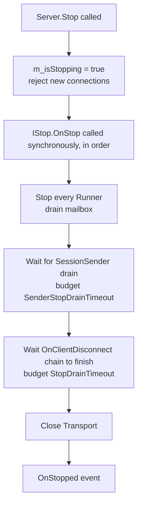

# Advanced Topics

> 中文版: [advanced.md](../zh/advanced.md)

This page collects the "you will need these sooner or later" capabilities: filter pipeline, SessionManager, Broadcast, graceful shutdown, Kick, request / heartbeat timeouts.

## Filter Pipeline

### Interface

```csharp
// Frameworks/Core/Interfaces/IFilter.cs
public interface IFilter
{
    void OnRegistered(IFilterable filterable);
    void OnClientConnected(uint clientId);
    void OnClientDisconnected(uint clientId);

    bool OnPreSend(Package pack);   // C -> S; true blocks
    void OnPostSend(Package pack);

    bool OnPreRecv(Package pack);   // S -> C; true blocks
    void OnPostRecv(Package pack);

    void OnError(uint clientId, Exception err);
}
```

### Typical Uses

1. **Logging**: capture every inbound/outbound package into structured logs.
2. **Heartbeat / idle detection**: kick silent clients.
3. **Auth gating**: drop every request but login-related ones before authentication (with `[BeforeLogin]`).
4. **Rate-limit / circuit breaker**: track QPS per route or per clientId.
5. **Audit trail**: record request ids and processing latency.

### Registration

```csharp
server.RegisterFilter(new LoggerFilter());
server.RegisterFilter(new IdleClearFilter());
```

Built-in samples:
- [`Demo.Common/LoggerFilter.cs`](../../Frameworks/Demo/Demo.Common/LoggerFilter.cs) - simplest print-to-log.
- Template's `Main/IdleClearFilter.cs` / `Main/LoggerFilter.cs`.
- [`Frameworks/Core/Filters/HeartbeatFilter.cs`](../../Frameworks/Core/Filters/HeartbeatFilter.cs) - installed by default; collects RTT stats.

### Execution Order

- Server: `Transport -> PreRecv filters -> Processor Runner -> Return Package -> PreSend filters -> Transport`.
- Client filter hook lives in `Client.Filterable.cs`; the interface is the same.

## SessionManager

Per-clientId server-side key/value bag, values constrained to Protobuf `IMessage`:

```csharp
// Frameworks/Server/SessionManagers/ISessionManager.cs
public interface ISessionManager
{
    T Get<T>(uint clientId, string key) where T : class, IMessage;
    void Set<T>(uint clientId, string key, T value) where T : class, IMessage;
    void Remove(uint clientId, string key);
    Dictionary<string, IMessage> GetAll(uint clientId);
    Dictionary<string, IMessage> GetAllPrefix(string prefix);
    Dictionary<string, IMessage> GetAllSuffix(string suffix);
}
```

Access from a processor via `Server.SessionManager`:

```csharp
[Request("login")]
public LoginResp Login(Header header, LoginReq req)
{
    var info = VerifyCredentials(req);
    Server.SessionManager.Set<LoginInfo>(header.ClientId, "login", info);
    return new LoginResp { ... };
}

[Request("profile")]
public ProfileResp GetProfile(Header header, Empty _)
{
    var info = Server.SessionManager.Get<LoginInfo>(header.ClientId, "login");
    if (info == null) throw new ProcessorMethodException(StatusCode.Failed, "NOT_LOGIN");
    ...
}
```

Sessions are created on `OnClientConnect` and cleared on `OnClientDisconnect`; cleanup hooks have isolated try/catch per processor.

## `[BeforeLogin]` Gating

Pre-login the client should only reach a tiny allow-list (the login route itself, anonymous handshake helpers, ...). Use `[BeforeLogin]`:

```csharp
[BeforeLogin]
[Request("login")]
public LoginResp Login(Header header, LoginReq req) { ... }

// No [BeforeLogin]: framework blocks unauthenticated clients
[Request("shop.buy")]
public BuyResp Buy(Header header, BuyReq req) { ... }
```

The implementation is a built-in filter: for every Request it checks the method's `[BeforeLogin]` attribute; otherwise it requires a session-side login marker. Business code may customise the rule.

## Broadcast

Cross-processor, cross-clientId event dispatch:

```csharp
// Producer: thread-safe; framework uses ConcurrentQueue + throttled drain
Server.Broadcast(header.ClientId, eventId: 42, data: new PlayerLeave { ... });

// Consumer: every processor receives; filter/handle as you wish
public override bool IsRecognizeBroadcastEvent(int eventId) => eventId == 42;

public override Task OnBroadcast(uint clientId, int eventId, object data)
{
    // Runs on this processor's runner thread - serial-safe
    var leave = (PlayerLeave)data;
    ...
    return Task.CompletedTask;
}
```

- Ordering **across** processors is not guaranteed (one ConcurrentQueue per processor); **within** a processor it stays FIFO.
- Each runner tick consumes up to `maxItems`; leftovers wait for the next tick. See [processor-model.md](./processor-model.md#broadcast-event-broadcast-across-processors).

## Graceful Shutdown

Orchestrated by [Frameworks/Server/Server.cs](../../Frameworks/Server/Server.cs):



Key mechanisms:
- `m_isStopping` volatile flag: `OnClientConnectEvent` checks it and kicks newcomers arriving after Stop.
- `m_liveClients` - one ticket per live connection: `TaskCompletionSource` registered at connect, `TrySetResult` after the entire OnClientDisconnect chain finishes, `Task.WhenAll` drains.
- Double timeout budget: 2s for senders, 10s overall drain - beats k8s `terminationGracePeriodSeconds` SIGKILL.

Processors that need to persist on shutdown implement `IStop.OnStop()`:

```csharp
public class DbSaverProcessor : ProcessorBase, IStop
{
    public void OnStop()
    {
        FlushPendingWrites();   // synchronous; drain will wait for this to return
    }
}
```

## Kick (server-initiated)

```csharp
Server.Kick(header.ClientId, reason: "BANNED");
```

Implementation: send a `PackageType.Kick` frame with `Status.Message = reason`; the client fires `OnKicked(reason)` and disconnects. Kicking is friendlier than `Transport.DisconnectClient` because the client learns *why* it dropped.

## Request Timeout

Client side: `Client.RequestTimeout` (default `5s`). `TimeoutLoop` periodically inspects in-flight `m_requestCallbacks`; expired ones complete via `OnResponse` with `StatusCode.Timeout` (`Message = "REQUEST_TIMEOUT"`).

```csharp
var client = new Client<NcClient>();
client.RequestTimeout = TimeSpan.FromSeconds(10);

var (status, resp) = await client.Echo_Timeout(new PbString{ Value = "x" });
if (status.Code == StatusCode.Timeout) { ... }
```

Note: `Timeout` is a **local** status; the server never sent a `Response`, so `resp` is `null`. Business code should distinguish `Success` / `Failed` (business) / `Timeout` + `Error` (network).

## Heartbeat Timeout

Client `HeartbeatLoop` ([Frameworks/Client/Client.Heartbeat.cs](../../Frameworks/Client/Client.Heartbeat.cs)):
- Wakes every `Consts.HeartBeat.Update` (typically 1s).
- Sends a Ping every `m_handshake.HeartBeatInterval` (server-provided, default ~3s).
- If a Pong is late beyond `Consts.HeartBeat.Timeout`, raises `HeartbeatTimeoutException` and disconnects.

Realtime RTT stats `PingAvg / Min / Max / Count` drive any network-quality UI.

## Concurrency & Locking Model

```text
Client request ─┐
               ├─► Framework inbound Dispatch ─► ProcessorRunner.mailbox ─► Route.Invoke
ProcessorRef  ─┘                                      │
(cross-processor call)                                │
                                                       ▼
                                                  single FIFO mailbox
                                            (strictly serial when MaxConcurrency=1)
```

- **Serial by default**: one processor has one "lock"; all fields and all routes are mutually exclusive.
- **Need parallelism**: tag the class with `[MaxConcurrency(N)]`; narrow further with method-level `[MaxConcurrency(M)]`. You then own the thread safety of any shared field (or use `ConcurrentDictionary`).
- **Never hold raw cross-processor instances**: always go through `Server.GetProcessor<T>()` + `[ProcessorApi]`, or the analyzer will yell.

## Debugging & Observability

- Print the route table at startup via `Server.OnStarted`: `foreach (var p in Server.Processors) ...`.
- Runner status at runtime: `Server.GetProcessorQueueStatus()` returns queue / broadcast peak per runner.
- Send queue: `Server.IsSendQueueFull` / `Server.SendQueueCount` / `Server.GetAllSendQueue()`.
- Client heartbeat: `PingAvg / Min / Max / Count`.
- UnitTest references: [Frameworks/UnitTest/TestStopDrain.cs](../../Frameworks/UnitTest/TestStopDrain.cs) (graceful shutdown), `TestMaxConcurrency.cs`, `TestDeferCall.cs`, `TestDelayCall.cs`.
