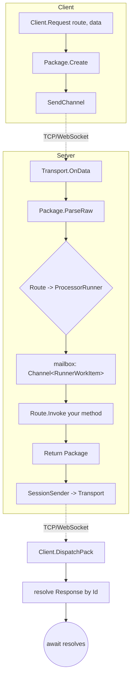

# Core Concepts

> 中文版: [concepts.md](../zh/concepts.md)

This page explains GoPlay's core terminology and how it positions against Pomelo, ET, ASP.NET Core and Orleans.

## Glossary

### Route

The **function address** between client and server, formatted as `"echo.request"` / `"test.echo"`. The prefix is the processor name (`[Processor("echo")]`), the suffix is the method name (`[Request("request")]`). Naming convention inherited from Pomelo.

### Request

Client sends a call and **awaits** the server's `Response`.

```csharp
// Client
var (status, resp) = await client.Echo_Request(new PbString { Value = "hi" });
```

```csharp
// Server
[Request("request")]
public PbString Request(Header header, PbString data) { ... return new PbString{...}; }
```

Correlation: `Request` &rarr; `Response` paired by `Header.PackageInfo.Id`.

### Notify

Client sends a message and **does not** wait for a response. The server method returns `void` (or `Task`).

```csharp
// Client
client.Echo_Notify(new PbString { Value = "hi" });

// Server
[Notify("notify")]
public void Notify(Header header, PbString data) { ... }
```

### Push

Server **proactively** delivers data to the client. A processor must declare pushable routes:

```csharp
public override string[] Pushes => new[] { "echo.push" };

Push("echo.push", header, new PbString { Value = "server push" });
```

Clients subscribe via `AddListener` / `WaitFor`.

### Processor

A bundle of related Request / Notify / Push methods, backing a single Actor (see [processor-model.md](./processor-model.md)). Each processor owns a dedicated `ProcessorRunner`; by default everything runs serially, so you never fight cross-request data races.

### ProcessorRef

Handle for cross-processor calls. `Server.GetProcessor<T>()` returns `ProcessorRef<T>` that posts closures to the target processor's mailbox for serial execution. Combined with `[ProcessorApi]` and the source generator, calls read exactly like a method call:

```csharp
await Server.GetProcessor<DbSaverProcessor>().SaveUser(userId, data);
```

### Session

A server-side key/value bag kept per `clientId` (typed with Protobuf `IMessage`). Managed by `ISessionManager`, accessed via `Server.SessionManager`. Sessions are created on connect and reclaimed on disconnect.

```csharp
Server.SessionManager.Set<LoginInfo>(header.ClientId, "login", info);
var info = Server.SessionManager.Get<LoginInfo>(header.ClientId, "login");
```

### Filter

Middleware that hooks into the Request / Response pipeline. Both client and server have it; common uses are logging, throttling and heartbeat handling. See [advanced.md](./advanced.md#filter-pipeline).

### ServerTag

Reserved cluster role marker (FrontEnd / BackEnd / All). In single-node mode clients send `FrontEnd`.

### Package / Header / PackageInfo

The unified communication unit. The Header carries Route / Id / Type / Status / Session; the body is your Protobuf payload. Byte layout in [protocol.md](./protocol.md).

## Request Flow Overview



## Comparison with Related Frameworks

GoPlay is not invented from scratch - it is a curated set of trade-offs on top of prior art.

### vs Pomelo (Node.js game server framework)

- **Directly inherited**: `processor.method` route naming, Request / Notify / Push triad, full route map delivered during handshake, session bound to clientId.
- **Key differences**:
  - GoPlay is statically typed C#: routes map to `[Request]` method signatures - IDE completion and compiler checks both work. Pomelo is dynamic.
  - Concurrency: GoPlay uses one dedicated Runner per processor (Actor); no explicit locking. Pomelo is a single-threaded event loop.
  - Codegen: GoPlay ships `goplay extension` to auto-generate client proxy methods. Pomelo clients typically write raw route strings.

### vs ET (Tencent's open-source game server framework)

- **Both**: C#, long-connection, Actor model.
- **Key differences**:
  - Actor granularity: ET uses `Entity` (usually one per player); GoPlay uses `Processor` (a feature module such as DbSaverProcessor, MatchProcessor).
  - So in ET a player is naturally one Actor; in GoPlay all players funnel into a feature's runner and queue there - great for "one queue per feature" semantics. Per-player mutual exclusion is done via `SessionManager` or your own `ConcurrentDictionary<clientId, ...>`.
  - GoPlay makes Transport / Encoder first-class replacement points (plug TCP / WS / Protobuf / Json freely); ET's transport layer is more fixed.

### vs ASP.NET Core

- **Similar**: attribute routing (`[HttpGet("foo")]` &harr; `[Request("foo")]`), DI-style registration (`services.AddXxx` &harr; `server.Register(new XxxProcessor())`), middleware/filter pipeline.
- **Key differences**:
  - ASP.NET is **short-connection** Request/Response; GoPlay is **long-connection** with Push / Notify / Broadcast.
  - ASP.NET allocates per-request scopes from DI; GoPlay processors are long-lived instances for the life of the process.
  - ASP.NET is stateless by default and scales horizontally via session stores; GoPlay processors are stateful (Actor mailbox), closer to Orleans / Akka.

### vs Orleans / Akka.NET

- **Similar**: Actor + mailbox, serial message processing inside an Actor.
- **Key differences**:
  - Orleans activates/deactivates Grains on demand (Virtual Actor). GoPlay creates processors up-front via `Server.Register(...)` and keeps them alive for the whole process.
  - Orleans emphasises distribution and location transparency; GoPlay today targets **single-node high concurrency**. Cluster mode is still on the roadmap (`TO-DO.md`).
  - Cross-actor calls in Orleans: `GrainFactory.GetGrain<T>(key)`; in GoPlay: `Server.GetProcessor<T>()` + source-generated extension methods. Compile-time checks are stronger (`[ProcessorApi]` + `Analyzer.ProcessorIsolation`).

## One-liner

If you like Pomelo's route model but want C# type safety and Protobuf performance, and you find ET's Entity-per-Actor granularity too fine-grained for feature layering, then GoPlay - Processor-as-Actor plus full Transport/Encoder separation plus client codegen - is built for exactly that sweet spot.
