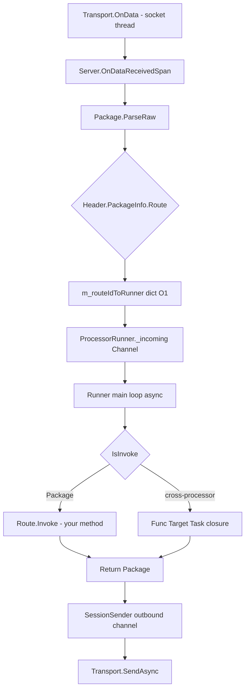

# Processor-Actor Model

> 中文版: [processor-model.md](../zh/processor-model.md)

GoPlay's most distinctive design choice: **every Processor is an Actor**, driven by a dedicated `ProcessorRunner` that processes its mailbox serially - so business code never needs locks; cross-processor calls go through `ProcessorRef`, which posts closures to the target mailbox and eliminates data races by construction.

## Definitions

- **Processor** ([Frameworks/Server/Processors/Base/ProcessorBase.cs](../../Frameworks/Server/Processors/Base/ProcessorBase.cs)): Business class extending `ProcessorBase`, annotated with `[Processor("name")]`. Long-lived; lasts for the whole server process.
- **ProcessorRunner** ([Frameworks/Server/Processors/ProcessorRunner.cs](../../Frameworks/Server/Processors/ProcessorRunner.cs)): One per processor. Internally a single-reader `Channel<RunnerWorkItem>` mailbox; the main loop is async.
- **ProcessorRef** ([Frameworks/Server/Processors/ProcessorRef.cs](../../Frameworks/Server/Processors/ProcessorRef.cs)): Cross-processor handle. `readonly struct`, zero heap allocations.

## Dispatch Path



Highlights:
- **O(1) routing**: `Dictionary<uint, ProcessorRunner>` built once in `BuildRouteMap`.
- **Serial semantics**: default `MaxConcurrency=1` means one work item at a time; business code can access processor fields without locking.
- **FIFO fairness**: incoming packages and cross-processor closures (`Work`) share the same mailbox and run in enqueue order.

## ProcessorBase: What a Processor Can Do

```csharp
[Processor("echo")]
public class EchoProcessor : ProcessorBase, IStart, IStop, IUpdate
{
    // 1. Route methods registered via attributes
    [Request("request")]
    public PbString Request(Header header, PbString data) { ... }

    [Notify("notify")]
    public void Notify(Header header, PbString data) { ... }

    // 2. Declare push-capable routes
    public override string[] Pushes => new[] { "echo.push" };

    // 3. Lifecycle hooks
    public void OnStart() { }
    public void OnStop() { }
    public Task OnUpdate() { ... }
    public override void OnClientConnected(uint clientId) { }
    public override void OnClientDisconnected(uint clientId) { }

    // 4. Proactive sends
    void Example(Header header)
    {
        Push("echo.push", header, new PbString { Value = "hi" });  // push to header.ClientId
        Return(header, new PbString { Value = "early return" });   // reply early
    }

    // 5. Deferred / delayed execution
    void Schedule()
    {
        DeferCall(async () => { /* enqueue to my runner mailbox */ });
        DelayCall(TimeSpan.FromSeconds(3), async () => { /* run 3s later */ });
    }
}
```

### Method Signature Rules

- `[Request("x")]` returns a **business Protobuf** (or `Task<TProto>`), parameters `(Header, TProtoRequest)`. The return value is wrapped into a `Response` frame automatically.
- `[Notify("x")]` returns `void` or `Task`, parameters `(Header, TProtoRequest)`. No reply.
- `Header` must be the first parameter. The second parameter can be omitted when only the route itself is meaningful.
- Throwing `ProcessorMethodException(StatusCode.Failed, "CODE")` sends a business error to the client; any other exception flows through `OnErrorEvent` and returns `StatusCode.Error`.

### Lifecycle Hooks

- `IStart.OnStart`: called synchronously once when `Server.Start()` runs, before any client connects. Good for loading static data.
- `IStop.OnStop`: called once after `Server.Stop()` drains. Good for persistence.
- `IUpdate.OnUpdate`: called by the runner's periodic tick (default 1 Hz, overridable via `UpdateDeltaTime`). Unity-like `Update`.
- `OnClientConnected` / `OnClientDisconnected`: every processor receives these with **isolated try/catch**: one processor throwing will not suppress others.

## Concurrency Control: Three-tier Override

```text
Server(defaultConcurrency)             ← constructor default (<=0 uses Environment.ProcessorCount)
      │
      ▼
[MaxConcurrency(N)] on class           ← overrides the server default; processor-wide cap
      │
      ▼
[MaxConcurrency(N)] on method          ← method-level cap; must be <= class cap
```

Declared in [Frameworks/Core/Attributes/MaxConcurrencyAttribute.cs](../../Frameworks/Core/Attributes/MaxConcurrencyAttribute.cs).

### Typical Configuration

```csharp
// Server-wide default: up to CPU-count concurrent in-flight per processor
var server = new Server<NcServer>(Environment.ProcessorCount);

[MaxConcurrency(1)]          // strict serial (old behaviour)
[Processor("db")]
class DbSaverProcessor : ProcessorBase
{
    [MaxConcurrency(4)]      // INVALID: method cap must be <= class cap
    [Request("save")]
    public async Task<PbBool> Save(Header h, UserData d) { ... }
}

[MaxConcurrency(8)]
[Processor("match")]
class MatchProcessor : ProcessorBase
{
    [MaxConcurrency(2)]      // OK: 2 <= 8
    [Request("joinRoom")]
    public async Task<Room> JoinRoom(Header h, JoinReq r) { ... }
}
```

- `MaxConcurrency == 1`: strict serial, no locks, slightly slower but safest.
- `MaxConcurrency > 1`: internally uses `ExclusiveScheduler` + `SemaphoreSlim` to limit synchronous sections. **If business fields are touched across concurrent awaits you are responsible for thread safety.**
- The `Analyzer.MaxConcurrency` Roslyn analyzer flags illegal configurations at compile time.

## Cross-Processor Calls: ProcessorRef

Holding another processor's raw instance (`Server.GetProcessorUnsafe<T>()`) **bypasses mailbox serialisation** and causes cross-runner data races. That escape hatch is `[Obsolete]` and exists only for migration.

Recommended pattern:

```csharp
// Target processor: annotate externally reachable methods with [ProcessorApi]
[Processor("db")]
public class DbSaverProcessor : ProcessorBase
{
    [ProcessorApi]
    public async Task<PbBool> SaveUser(uint userId, UserData data) { ... }

    [ProcessorApi(Fire = true)]      // fire-and-forget
    public async Task LogEvent(string evt) { ... }
}

// Caller: get a Ref and call the generated extension
[Processor("game")]
public class GameProcessor : ProcessorBase
{
    [Request("doSomething")]
    public async Task<PbBool> DoSomething(Header header, ReqX data)
    {
        var ok = await Server.GetProcessor<DbSaverProcessor>()
                               .SaveUser(header.ClientId, ...);
        Server.GetProcessor<DbSaverProcessor>().LogEvent("done");
        return ok;
    }
}
```

### Source-Generated Extensions

`Tools/Generator.ProcessorRef` is a Roslyn **source generator**. It scans all `[ProcessorApi]` methods and emits a same-named extension on `ProcessorRef<T>` for each:

```csharp
// Auto-generated
public static Task<PbBool> SaveUser(this ProcessorRef<DbSaverProcessor> self, uint userId, UserData data)
    => self.Request(p => p.SaveUser(userId, data));

public static void LogEvent(this ProcessorRef<DbSaverProcessor> self, string evt)
    => self.Notify(p => p.LogEvent(evt));
```

Business code just sees a regular `await` call.

### Runtime Semantics

- **Request** (returns `Task<T>` or `Task`): posts the closure to the target mailbox, awaits the result; exceptions are re-thrown through the awaiter.
- **Notify** (`Fire=true` or `void` return): fire-and-forget. Exceptions flow to `Server.OnErrorEvent` and never escape.
- **Re-entrant inline**: when caller and target share the **same** runner (self-call), `Request` inlines `fn(Target)` to avoid mailbox self-wait deadlocks; `Notify` still enqueues.

## DeferCall / DelayCall

Two hooks for "**run later on my own runner**":

```csharp
void Example()
{
    DeferCall(async () => {
        // enqueue into this runner's mailbox; queued FIFO with client requests
    });

    DelayCall(TimeSpan.FromSeconds(5), async () => {
        // runs once after 5s on this runner
    });
}
```

- Both are **thread-safe**: cross-runner calls hop through `Runner.Post` before touching `m_delayTasks`, so the list never tears.
- `DelayCall` expiry is checked by the runner's periodic tick; granularity equals tick resolution (~1s by default).

## Broadcast: Event Broadcast Across Processors

- `Server.Broadcast(clientId, eventId, data)` enqueues `(clientId, eventId, object)` into every processor's `_broadcastQueue`.
- Each periodic tick drains up to `maxItems` via `ResolveBroadCast` into `Processor.OnBroadcast`. Remaining items wait for the next tick. This prevents a broadcast storm from starving `Update` / `DeferCall` / `DelayCall`.
- Processors can `override IsRecognizeBroadcastEvent(eventId)` to short-circuit.

## Common Patterns

### Pattern 1: Naturally Serial Business Processor

```csharp
[Processor("match")]
public class MatchProcessor : ProcessorBase
{
    private readonly Dictionary<uint, Room> _rooms = new();   // lock-free; runner serialises

    [Request("join")]
    public async Task<JoinResp> Join(Header h, JoinReq req)
    {
        _rooms.TryGetValue(req.RoomId, out var room) // no race
        ...
    }
}
```

### Pattern 2: DB Access Concurrency Cap

```csharp
[MaxConcurrency(16)]                                 // 16 in-flight SQL
[Processor("db")]
public class DbSaverProcessor : ProcessorBase
{
    [ProcessorApi]
    public async Task<int> SaveUser(uint userId, UserData d)
    {
        return await _dbPool.ExecuteAsync(...);      // processor-wide cap = 16
    }
}
```

### Pattern 3: DelayCall for Timeouts

```csharp
[Request("quickBattle")]
public PbBool StartBattle(Header h, BattleReq req)
{
    // Broadcast victory if no result in 3s
    DelayCall(TimeSpan.FromSeconds(3), async () =>
    {
        if (IsResolved(h.ClientId)) return;
        Push("battle.finish", h, new BattleResult { Winner = h.ClientId });
    });
    return new PbBool { Value = true };
}
```

## Comparisons

### vs ET's Entity-Actor

| Dimension | ET | GoPlay |
|-----------|----|--------|
| Actor granularity | per Entity (usually per player) | per Processor (feature module) |
| Cross-player exclusion | natural (different entities, different actors) | serial within one processor; cross-player exclusion is business-driven |
| Cross-actor call | `ActorLocationSender` | `Server.GetProcessor<T>()` + source-generated extension |
| State location | inside Entity | processor fields / `SessionManager` |

ET fits player-centric MMOs. GoPlay fits feature-partitioned systems (lobby, match, battle, DB as separate processors).

### vs Orleans Grain

| Dimension | Orleans | GoPlay |
|-----------|---------|--------|
| Activation | on-demand activate/deactivate (Virtual Actor) | register at startup; lives for the whole process |
| Call entry | `GrainFactory.GetGrain<T>(key)` | `Server.GetProcessor<T>()` |
| Distribution | built-in, location transparent | single-node today; cluster mode on the roadmap |
| Cross-call | interface + codegen proxy | `[ProcessorApi]` + Roslyn source generator |
| Concurrency | serial inside a grain | serial inside a processor, tunable via `[MaxConcurrency]` |

GoPlay processors are close to "long-lived, strongly-typed, concurrency-configurable grains".

## Debugging & Observability

- `Server.GetProcessorQueueStatus()` returns `IEnumerable<ProcessorStatus>` - inspect queue depth and broadcast peak depth per runner.
- See [Frameworks/UnitTest/TestMaxConcurrency.cs](../../Frameworks/UnitTest/TestMaxConcurrency.cs), `TestDeferCall.cs`, `TestDelayCall.cs` for official behavioural assertions on the runner.
