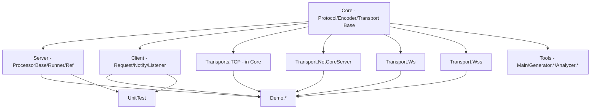

# Repository Structure

> 中文版: [structure.md](../zh/structure.md)

GoPlay.Net is a multi-language, multi-transport long-connection RPC framework. The top-level layout separates "framework body / clients / tools / templates / docs".

## Top-level Layout

```text
GoPlay.Net/
  Frameworks/           # C# body (Core/Server/Client/Transport*/Demo/UnitTest/Benchmark)
  Clients/              # Non-C# clients (TypeScript / JavaScript)
  Tools/                # goplay CLI, source generators, analyzers
  ProjectTemplates/     # dotnet new templates (TCP / WebSocket)
  Docs/                 # Docs (split by language: en/ and zh/)
  scripts/              # Helper scripts
  LICENSE
  README.md
```

## Inside Frameworks

```text
Frameworks/
  Core/                 # Protocol, encoders, transport abstractions - the only foundation
    Attributes/         # [Processor] [Request] [Notify] [ProcessorApi] [MaxConcurrency] ...
    Protocols/          # Generated from protocol.proto + hand-written extensions
    Encodes/            # Protobuf / Json IEncoder implementations
    Transports/Base/    # TransportServerBase / TransportClientBase
    Transports/TCP/     # Built-in TcpServer / TcpClient (pull semantics)
    Interfaces/         # IEncoder / IFilter / IFilterable / IPackageSender ...
    Filters/            # HeartbeatFilter and other built-ins
    Utils/              # IdLoopGenerator / TaskUtil / AppUtil
  Server/               # Server / ProcessorBase / ProcessorRunner / ProcessorRef / SessionManager
    Processors/Base/    # ProcessorBase
    Processors/         # ProcessorRunner / ProcessorRef
    Senders/            # SessionSender (one outbound channel per session)
    SessionManagers/    # ISessionManager
  Client/               # Client / Chunk / Handshake / Heartbeat / PackageCallback
  Transport.NetCoreServer/  # High-performance NC transport (push semantics, TCP)
  Transport.Ws/         # WebSocket transport
  Transport.Wss/        # Secure WebSocket transport
  Demo/                 # Demo.Common / Demo.TcpServer / Demo.WsServer / Demo.WssServer
  UnitTest/             # Full test suite (TestNetCoreServer / TestWsServer / TestMaxConcurrency ...)
  Benchmark/            # BenchmarkDotNet micro-benchmarks (see Frameworks/Benchmark/README.md)
  Res/Proto3/           # .proto sources (protocol.proto / basic.proto)
  Scripts/              # Framework packaging scripts: build_nupkg.sh / publish_nupkg.sh
  ThirdParty/           # Submodule deps (NetCoreServer etc.)
  Server.sln            # Main solution
```

## Module Dependency Graph



- `Core` is the only foundation: every transport, server and client depends on it.
- Transport implementations are independent of each other - pull in only what you need.
- Demo / UnitTest are pure consumers; no production code depends back on them.

## NuGet Packages &#x2194; Projects

Every `PackageId` is declared in the matching csproj:

- `GoPlay.Core` &#x2190; [Frameworks/Core/Core.csproj](../../Frameworks/Core/Core.csproj)
- `GoPlay.Server` &#x2190; [Frameworks/Server/Server.csproj](../../Frameworks/Server/Server.csproj)
- `GoPlay.Client` &#x2190; [Frameworks/Client/Client.csproj](../../Frameworks/Client/Client.csproj)
- `GoPlay.Core.Transport.NetCoreServer` &#x2190; [Frameworks/Transport.NetCoreServer/Transport.NetCoreServer.csproj](../../Frameworks/Transport.NetCoreServer/Transport.NetCoreServer.csproj)
- `GoPlay.Core.Transport.Ws` / `GoPlay.Core.Transport.Wss` &#x2190; Transport.Ws / Transport.Wss
- `GoPlay.Tools` (`dotnet tool`, command name `goplay`) &#x2190; [Tools/Main/Main.csproj](../../Tools/Main/Main.csproj)
- `GoPlay.Templates` &#x2190; [ProjectTemplates/GoPlay.Templates.csproj](../../ProjectTemplates/GoPlay.Templates.csproj)

`Core`/`Server`/`Client` target `net7.0;net8.0;net9.0;net10.0`. `Client` also targets `netstandard2.1` for Unity and older runtimes.

## Clients/ (non-C#)

```text
Clients/
  Typescript/     # npm package goplay-ws (WebSocket + Protobuf), dist/ is the build output
    src/          # goplay.ts / ByteArray.ts / Package.ts etc.
    unit_test/    # Jest tests, including e2e/goplay.Request.test.ts
    demo/         # Browser demo
  Javascript/     # Pure JS + protobuf.min.js, no build step, fits drop-in game embedding
    goplay.client.js
    demo/
```

## Tools/

```text
Tools/
  Main/                   # dotnet tool entry, command name `goplay` (extension/config/excel2proto)
  Generator.Core/         # Shared codegen foundation
  Generator.Extension/    # Scan processors and emit client/server extensions (Liquid templates)
  Generator.Config/       # Excel -> cs + yaml/json
  Generator.ProcessorRef/ # Roslyn source generator: [ProcessorApi] methods -> ProcessorRef<T> extensions
  Analyzer.ProcessorIsolation/  # Roslyn analyzer: forbid cross-processor direct calls
  Analyzer.MaxConcurrency/      # Roslyn analyzer: validate [MaxConcurrency]
```

## ProjectTemplates/

Install `GoPlay.Templates` and two `dotnet new` templates become available:

- `goplay-tcp` (built on `NcServer`, TCP push semantics, highest throughput)
- `goplay-ws` (built on `WsServer`, fits browser / WeChat mini-game scenarios)

Each template ships with:
- `Main/` - program entry (`System.CommandLine` + `HostBuilder`)
- `ProcessorsBase/` - shared base class for your business processors
- `Processors.Logic/`, `Processors.Admin/`, `Processors.DbSaver/` - ready-to-extend processor slots
- `Client.Extension/` - output directory of `goplay extension`
- `Common/` - `RunArgs`, `AppConfig`, `SessionManager` extensions
- `UnitTests/` - NUnit end-to-end examples
- `scripts/` - `gen_ext.sh` / `gen_proto.sh` / `gen_config.sh`

## Build and Publish Scripts

- [Frameworks/Scripts/build_nupkg.sh](../../Frameworks/Scripts/build_nupkg.sh) / [Frameworks/Scripts/publish_nupkg.sh](../../Frameworks/Scripts/publish_nupkg.sh) - pack and publish framework NuGets
- [Tools/publish_local.sh](../../Tools/publish_local.sh) - install `goplay` CLI as a local `dotnet tool`
- [Tools/publish_nuget.sh](../../Tools/publish_nuget.sh) - publish `GoPlay.Tools`
- Per-project `scripts/` - business-side codegen scaffolding
