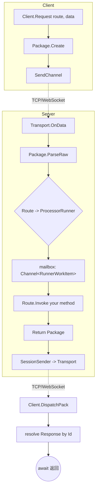

# 核心概念

> English version: [03.concepts.md](../en/03.concepts.md)

本页解释 GoPlay 的核心术语，以及它与 Pomelo / ET / ASP.NET Core / Orleans 的定位差异。

## 术语表

### Route

客户端和服务端之间的**函数地址**，形如 `"echo.request"` / `"test.echo"`。前半段是 Processor 名（`[Processor("echo")]`），后半段是方法名（`[Request("request")]`）。命名惯例承袭自 Pomelo。

### Request

客户端发起一次调用，**等待**服务端返回 `Response`。

```csharp
// Client
var (status, resp) = await client.Echo_Request(new PbString { Value = "hi" });
```

```csharp
// Server
[Request("request")]
public PbString Request(Header header, PbString data) { ... return new PbString{...}; }
```

对应 PackageType：`Request` &rarr; `Response`，靠 `Header.PackageInfo.Id` 回包对齐。

### Notify

客户端发一条消息，**不等**回包。服务端方法签名返回 `void`（或 `Task`）。

```csharp
// Client
client.Echo_Notify(new PbString { Value = "hi" });

// Server
[Notify("notify")]
public void Notify(Header header, PbString data) { ... }
```

### Push

服务端**主动**下发给客户端。Processor 必须在 `Pushes` 里声明能推哪些 route：

```csharp
public override string[] Pushes => new[] { "echo.push" };

Push("echo.push", header, new PbString { Value = "server push" });
```

客户端用 `AddListener` / `WaitFor` 订阅。

### Processor

一组相关的 Request / Notify / Push 方法的集合，对应一个 Actor（见 [04.processor-model.md](./04.processor-model.md)）。每个 Processor 有独占的 `ProcessorRunner`，默认串行执行，不会有跨 request 的数据竞争。

### ProcessorRef

跨 Processor 调用句柄。`Server.GetProcessor<T>()` 返回 `ProcessorRef<T>`，把闭包投递到目标 Processor 的 mailbox 串行执行。配合 `[ProcessorApi]` 标注与源生成器，调用看起来就像直接调方法：

```csharp
await Server.GetProcessor<DbSaverProcessor>().SaveUser(userId, data);
```

### Session

服务端为每个 `clientId` 维护的一份键值对（Protobuf `IMessage` 类型安全）。由 `ISessionManager` 管理，`Processor` 通过 `Server.SessionManager` 访问。Session 在客户端连上时创建，断开时回收。

```csharp
Server.SessionManager.Set<LoginInfo>(header.ClientId, "login", info);
var info = Server.SessionManager.Get<LoginInfo>(header.ClientId, "login");
```

### Filter

横切 Request / Response 管线的中间件。客户端、服务端都有，典型应用有日志、节流、心跳处理。见 [08.advanced.md](./08.advanced.md#filter-管线)。

### ServerTag

集群模式预留的服务器角色标记（FrontEnd / BackEnd / All），单机模式下客户端发 `FrontEnd` 即可。

### Package / Header / PackageInfo

框架内部统一的通信单元。Header 里带 Route / Id / Type / Status / Session，Body 是业务 Protobuf。字节布局见 [10.protocol.md](./10.protocol.md)。

## 请求总览



## 与同类框架的对比

GoPlay 不是凭空生出来的 —— 它是在"学了一圈已有方案"后做的取舍。

### vs Pomelo（Node.js 游戏服务器框架）

- **直接借鉴**的部分：Route 命名规则 `processor.method`；Request / Notify / Push 三分法；Handshake 阶段下发全量 Route 映射表；Session 与 clientId 绑定。
- **关键差异**：
  - GoPlay 是 C# 静态类型，Route 对应 `[Request]` 方法签名，IDE 能补全、编译器能查；Pomelo 是动态。
  - 并发模型：GoPlay 每 Processor 一个独占 Runner（Actor），无需手动加锁；Pomelo 是单线程事件循环。
  - 代码生成：GoPlay 提供 `goplay extension` 自动生成客户端代理方法；Pomelo 客户端多走手写请求字符串。

### vs ET（腾讯开源的游戏服务器框架）

- **都是**：C# 长连接、支持 Actor 模型。
- **关键差异**：
  - Actor 粒度：ET 以 `Entity`（通常对应一个玩家）为 Actor 单位；GoPlay 以 `Processor`（功能模块，比如 DbSaverProcessor、MatchProcessor）为 Actor 单位。
  - 所以在 ET 里写玩家逻辑天然一个玩家一个 Actor；在 GoPlay 里写功能模块则把所有玩家请求都汇总到该模块的 Runner 里排队 —— 适合"一类请求一把锁"的业务；玩家级互斥则通过 `SessionManager` 或业务自己的 `ConcurrentDictionary<clientId, ...>` 做。
  - GoPlay 明确把 Transport / Encoder 做成替换点（TCP / WS / Protobuf / Json 即插即用），ET 的传输层相对固定。

### vs ASP.NET Core

- **相似**：Attribute 路由（`[HttpGet("foo")]` &harr; `[Request("foo")]`）；DI 风格的服务端注册（`services.AddXxx` &harr; `server.Register(new XxxProcessor())`）；中间件/Filter 管线。
- **关键差异**：
  - ASP.NET 是**短连接**的 Request/Response；GoPlay 是**长连接**，支持 Push / Notify / Broadcast。
  - ASP.NET 每请求独立作用域、DI 生成对象；GoPlay 的 Processor 是长驻实例，生命周期覆盖整个服务器进程。
  - ASP.NET 默认无状态、水平扩展通过 Session 存储；GoPlay 的 Processor 本身就有状态（Actor mailbox），并发模型更接近 Orleans / Akka。

### vs Orleans / Akka.NET

- **相似**：都是 Actor + mailbox 模型，单 Actor 内串行处理消息。
- **关键差异**：
  - Orleans 的 Grain 按需激活 / 回收（Virtual Actor），GoPlay 的 Processor 在 `Server.Register(...)` 启动时建好、整个进程生命周期都在。
  - Orleans 强调分布式与位置透明；GoPlay 目前主要是**单机高并发**的设计，集群模式仍在 TO-DO（见仓库根 `TO-DO.md`）。
  - Orleans 跨 Grain 调用是 `GrainFactory.GetGrain<T>(key)`，GoPlay 跨 Processor 调用是 `Server.GetProcessor<T>()` + 源生成器扩展方法，编译期检查更强（`[ProcessorApi]` + `Analyzer.ProcessorIsolation`）。

## 一句话总结

如果你喜欢 Pomelo 的 route 模型但想要 C# 的类型安全和 Protobuf 性能，又觉得 ET 的 Entity-Actor 粒度对功能分层不够清晰，那 GoPlay 的 Processor-as-Actor + 完整的 Transport/Encoder 分离 + 客户端代码生成，就是为这个 sweet spot 设计的。
