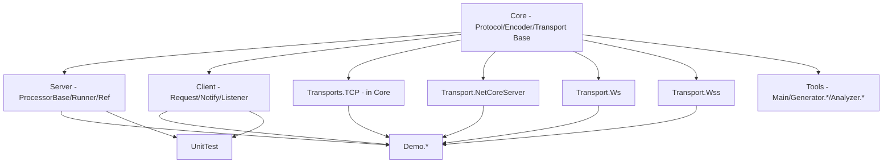

# 仓库结构

> English version: [09.structure.md](../en/09.structure.md)

GoPlay.Net 是一个多语言、多 Transport 的长连接 RPC 框架。仓库按"框架主体 / 客户端 / 工具 / 模板 / 文档"做顶层切分。

## 顶层布局

```text
GoPlay.Net/
  Frameworks/           # C# 主体（Core/Server/Client/Transport*/Demo/UnitTest/Benchmark）
  Clients/              # 非 C# 客户端（TypeScript / JavaScript）
  Tools/                # goplay CLI、源生成器、静态分析器
  ProjectTemplates/     # dotnet new 模板（TCP / WebSocket）
  Docs/                 # 文档（按语言分 en/ 与 zh/）
  scripts/              # 辅助脚本
  LICENSE
  README.md
```

## Frameworks 内部

```text
Frameworks/
  Core/                 # 协议、编码器、Transport 抽象基类，所有其他项目的依赖底
    Attributes/         # [Processor] [Request] [Notify] [ProcessorApi] [MaxConcurrency] ...
    Protocols/          # protocol.proto 生成代码 + 手写增强（Header/Status）
    Encodes/            # Protobuf / Json 两种 IEncoder 实现
    Transports/Base/    # TransportServerBase / TransportClientBase 抽象
    Transports/TCP/     # 内置 TcpServer / TcpClient（pull 语义）
    Interfaces/         # IEncoder / IFilter / IFilterable / IPackageSender ...
    Filters/            # HeartbeatFilter 等内置 filter
    Utils/              # IdLoopGenerator / TaskUtil / AppUtil
  Server/               # 服务端实现：Server/ProcessorBase/ProcessorRunner/ProcessorRef/SessionManager
    Processors/Base/    # ProcessorBase
    Processors/         # ProcessorRunner / ProcessorRef
    Senders/            # SessionSender（每 session 一个出站 Channel）
    SessionManagers/    # ISessionManager
  Client/               # 客户端实现：Client/Chunk/Handshake/Heartbeat/PackageCallback
  Transport.NetCoreServer/  # 高性能 NC Transport（push 语义，TCP）
  Transport.Ws/         # WebSocket Transport
  Transport.Wss/        # Secure WebSocket Transport
  Demo/                 # Demo.Common / Demo.TcpServer / Demo.WsServer / Demo.WssServer
  UnitTest/             # 全量单测（TestNetCoreServer / TestWsServer / TestMaxConcurrency ...）
  Benchmark/            # BenchmarkDotNet 基准（详见 Frameworks/Benchmark/README.md）
  Res/Proto3/           # .proto 源文件（protocol.proto / basic.proto）
  Scripts/              # 框架打包脚本：build_nupkg.sh / publish_nupkg.sh
  ThirdParty/           # 子模块依赖（NetCoreServer 等）
  Server.sln            # 主 Solution
```

## 模块依赖关系



- `Core` 是唯一的底：所有 Transport 实现、Server、Client 都只依赖它。
- Transport 实现互不依赖，按需引入（只用 TCP 时不会被拉进 WebSocket 依赖）。
- Demo / UnitTest 只是消费方，不会被其他生产代码依赖。

## NuGet 产物 ↔ 项目映射

所有 `PackageId` 来自各自 csproj 文件，见：

- `GoPlay.Core` ← [Frameworks/Core/Core.csproj](../../Frameworks/Core/Core.csproj)
- `GoPlay.Server` ← [Frameworks/Server/Server.csproj](../../Frameworks/Server/Server.csproj)
- `GoPlay.Client` ← [Frameworks/Client/Client.csproj](../../Frameworks/Client/Client.csproj)
- `GoPlay.Core.Transport.NetCoreServer` ← [Frameworks/Transport.NetCoreServer/Transport.NetCoreServer.csproj](../../Frameworks/Transport.NetCoreServer/Transport.NetCoreServer.csproj)
- `GoPlay.Core.Transport.Ws` / `GoPlay.Core.Transport.Wss` ← 对应 Transport.Ws / Transport.Wss 项目
- `GoPlay.Tools`（`dotnet tool`，命令名 `goplay`）← [Tools/Main/Main.csproj](../../Tools/Main/Main.csproj)
- `GoPlay.Templates` ← [ProjectTemplates/GoPlay.Templates.csproj](../../ProjectTemplates/GoPlay.Templates.csproj)

`Core`/`Server`/`Client` 同时面向 `net7.0;net8.0;net9.0;net10.0`，其中 `Client` 额外支持 `netstandard2.1`（用于 Unity 与老 runtime）。

## Clients/（非 C#）

```text
Clients/
  Typescript/     # npm 包 goplay-ws（WebSocket + Protobuf），dist/ 为打包产物
    src/          # goplay.ts / ByteArray.ts / Package.ts 等
    unit_test/    # Jest 单测，含 e2e/goplay.Request.test.ts 端到端
    demo/         # 浏览器 demo
  Javascript/     # 纯 JS + protobuf.min.js，零构建，适合无构建链的游戏嵌入
    goplay.client.js
    demo/
```

## Tools/

```text
Tools/
  Main/                   # dotnet tool 入口，命令名 goplay（extension/config/excel2proto）
  Generator.Core/         # 代码生成公共基础
  Generator.Extension/    # 扫描 Processor 输出客户端/服务端扩展（Liquid 模板）
  Generator.Config/       # Excel → cs + yaml/json
  Generator.ProcessorRef/ # Roslyn 源生成器：[ProcessorApi] 方法 → ProcessorRef<T> 扩展
  Analyzer.ProcessorIsolation/  # Roslyn 静态分析：禁止跨 Processor 裸调用
  Analyzer.MaxConcurrency/      # Roslyn 静态分析：[MaxConcurrency] 合法性
```

## ProjectTemplates/

`dotnet new install GoPlay.Templates` 后可用两个模板：

- `goplay-tcp`（基于 `NcServer`，Tcp push 语义，性能最高）
- `goplay-ws`（基于 `WsServer`，适合浏览器 / 微信小游戏等）

每个模板都自带：
- `Main/`：程序入口（`System.CommandLine` + `HostBuilder`）
- `ProcessorsBase/`：业务 Processor 的公共父类
- `Processors.Logic/`、`Processors.Admin/`、`Processors.DbSaver/`：按职责切分的 Processor
- `Client.Extension/`：`goplay extension` 输出的客户端扩展方法
- `Common/`：`RunArgs`、`AppConfig`、`SessionManager` 扩展等
- `UnitTests/`：NUnit 端到端测试样例
- `scripts/`：`gen_ext.sh` / `gen_proto.sh` / `gen_config.sh`

## 构建与发布脚本

- [Frameworks/Scripts/build_nupkg.sh](../../Frameworks/Scripts/build_nupkg.sh) / [Frameworks/Scripts/publish_nupkg.sh](../../Frameworks/Scripts/publish_nupkg.sh)：打包并发布框架主体 NuGet
- [Tools/publish_local.sh](../../Tools/publish_local.sh)：把 `goplay` CLI 装到本地 `dotnet tool`
- [Tools/publish_nuget.sh](../../Tools/publish_nuget.sh)：发布 `GoPlay.Tools`
- 各项目内 `scripts/`：业务侧的代码生成脚手架
