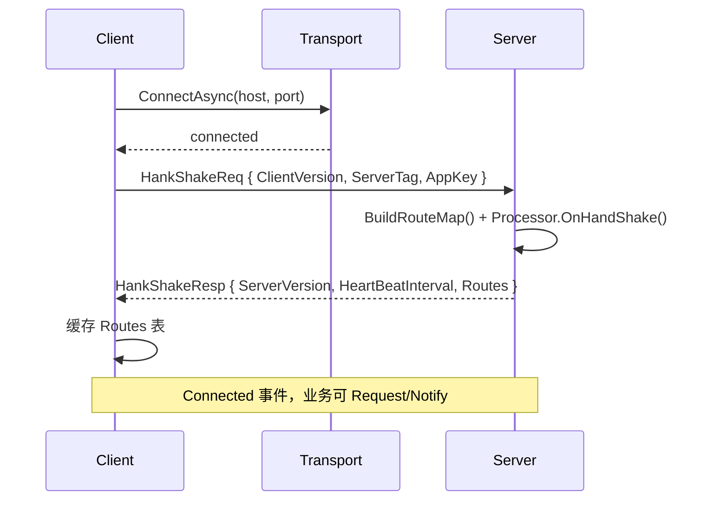
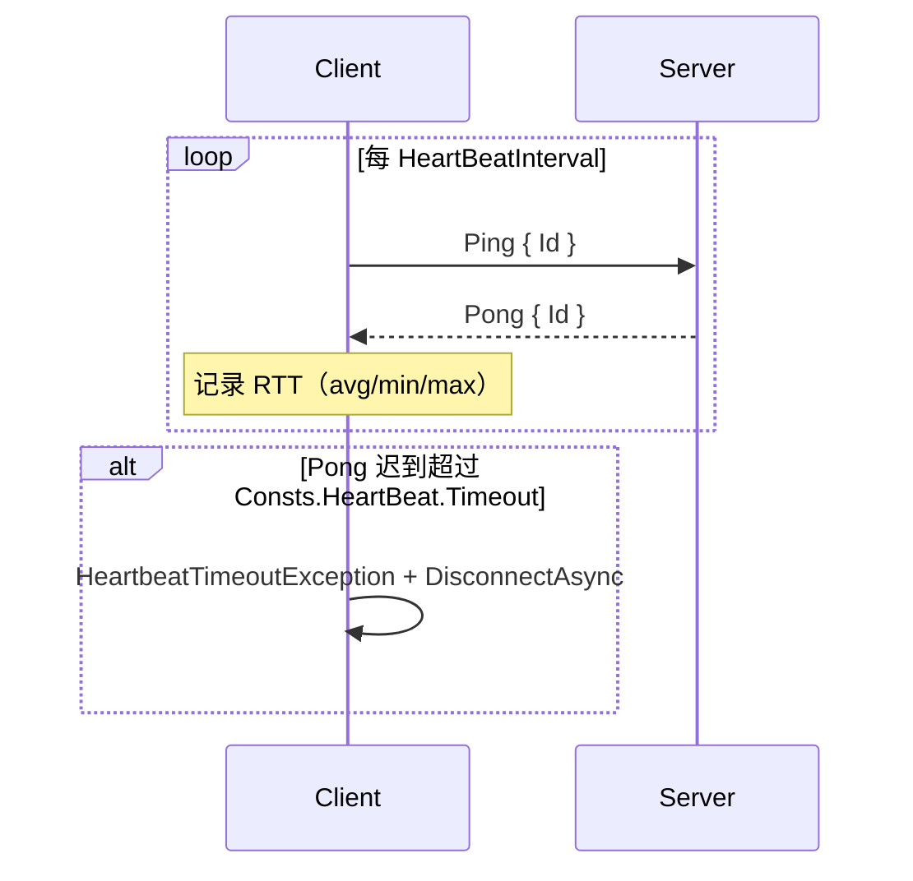
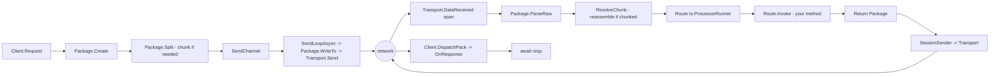

# 协议规范

> English version: [10.protocol.md](../en/10.protocol.md)

GoPlay 的 wire protocol 由两部分构成：**外层 framing**（二进制长度前缀）和**内层 Header + Body**（Protobuf 或 Json 编码）。本文描述完整帧格式、握手/心跳/分包/踢人等所有 PackageType 的语义与字节布局。

协议源文件：[Frameworks/Res/Proto3/protocol.proto](../../Frameworks/Res/Proto3/protocol.proto)、[Frameworks/Res/Proto3/basic.proto](../../Frameworks/Res/Proto3/basic.proto)。

## Wire Frame 字节布局

```text
  0   1   2   3   4            4+H          4+H+B
  +---+---+---+---+-----------+------------+
  | outerLen  | headerLen | Header  |  Body  |
  |  (ushort) | (ushort)  | (bytes) | (bytes)|
  +---------+-----------+---------+---------+
                 \_____ innerLen _______/

  outerLen = 2 + headerLen + bodyLen   // 不含 outerLen 自己的 2 字节
  innerLen = outerLen
  H = headerLen, B = bodyLen
```

- 所有长度字段是 **little-endian ushort**（最大 65535）。
- 单个 Package 的 `headerLen + bodyLen` 不能超过 `ushort.MaxValue - 2`。超出时必须走**分包（Chunk）**，见下文。
- 编码实现见 [Frameworks/Core/Protocols/Package.cs](../../Frameworks/Core/Protocols/Package.cs)（`WriteTo` / `ParseRaw`）。

## Header（Protobuf message）

```proto
message Status {
  StatusCode Code = 1;
  string Message  = 2;
}

message Session {
  string Guid = 1;
  map<string, google.protobuf.Any> Values = 2;
}

message PackageInfo {
  PackageType Type         = 1;
  uint32 Id                = 2;   // 客户端的请求 Id，用于 Response 回传对齐
  EncodingType EncodingType = 3;   // 0=Protobuf, 1=Json
  uint32 Route             = 4;   // 握手时由服务端分配
  uint32 ContentSize       = 5;   // body 字节数，等价于帧尾 bodyLen
  uint32 ChunkCount        = 6;   // 分包总数，未分包时=0 或 1
  uint32 ChunkIndex        = 7;   // 当前分片序号（从 0 开始）
}

message Header {
  Status Status           = 1;
  Session Session         = 2;
  PackageInfo PackageInfo = 3;
}
```

## PackageType 枚举

| 值 | 名称 | 方向 | 语义 |
|----|------|------|------|
| 0 | `HankShakeReq` | C → S | 握手请求 |
| 1 | `HankShakeResp` | S → C | 握手响应（带全量 Route 映射） |
| 2 | `Ping` | S → C | 心跳请求 |
| 3 | `Pong` | C → S | 心跳响应 |
| 4 | `Notify` | C → S | 客户端通知，不等回包 |
| 5 | `Request` | C → S | 客户端请求，等待对应 Id 的 Response |
| 6 | `Response` | S → C | 服务端对 Request 的回包 |
| 7 | `Push` | S → C | 服务端主动推送 |
| 8 | `Kick` | S → C | 服务端踢人，`Status.Message` 为原因 |

> 本框架沿用 Pomelo 的 Request/Notify/Push 三分法；历史原因枚举名保留 `HankShake`（拼写不变）。

## StatusCode 枚举

| 值 | 名称 | 含义 |
|----|------|------|
| 0 | `Success` | 成功 |
| 1 | `Failed` | 业务失败，`Status.Message` 为业务错误码 |
| 2 | `Error` | 框架/连接层错误（NETWORK_ERROR 等） |
| 3 | `Timeout` | 请求超时（客户端本地产生） |

## 握手时序

握手是客户端连上 Transport 之后**第一个包**，服务端回包里带全量 Route 表。业务侧的 `Request("xxx")` 都要先经过一次路由表查询。



`ReqHankShake` / `RespHandShake` 定义：

```proto
message ReqHankShake {
  string ClientVersion = 1;
  ServerTag ServerTag  = 2;
  string AppKey        = 3;
}

message RespHandShake {
  string ServerVersion       = 1;
  uint32 HeartBeatInterval   = 2;   // 毫秒
  map<string, uint32> Routes = 3;   // "processor.method" -> routeId
}
```

- 路由字符串采用 Pomelo 式 `"processor.method"` 小写规范。例如 `[Processor("echo")]` 的 `[Request("request")]` 方法 → `"echo.request"`。
- Route id 在服务端由 `IdLoopGenerator.Next()` 分配，每次启动可能不同 —— 所以客户端**必须**用握手回的映射表，不能硬编码 route id。

## 心跳时序

`HeartBeatInterval` 由服务端在握手响应中告知（默认约 3s）。心跳由**客户端**驱动：



实现位于 [Frameworks/Client/Client.Heartbeat.cs](../../Frameworks/Client/Client.Heartbeat.cs)。Pong 路径 `ResolvePong` 会用 Ping 的 `Id` 回对，得到 RTT 并更新统计。

## Kick 帧

服务端主动关闭某个 clientId 时发出：

```text
Header.PackageInfo.Type = Kick
Header.Status.Code      = Error / Failed
Header.Status.Message   = "reason string"
Body                    = 空
```

客户端收到 Kick 后进入 `OnKicked(reason)` 回调并立即 `DisconnectAsync()`。

## Chunk 分包

当单帧业务数据超过 `ushort.MaxValue` 上限时，`Package.Split()` 会把一条逻辑包切成多条物理帧：

```text
Header.PackageInfo {
  Type        = Request/Response/Push/Notify,
  Id          = 统一的逻辑包 id,
  Route       = 统一 routeId,
  ChunkCount  = N,                // 总分片数，> 1 才认为是分包
  ChunkIndex  = 0 .. N-1,         // 单调递增
}
```

接收侧（C# 见 [Frameworks/Client/Client.Chunk.cs](../../Frameworks/Client/Client.Chunk.cs)，服务端见 `Server.Chunk` 逻辑）按 `Id` 聚合，到齐 `ChunkCount` 条后才向上层分发一次，拼回整包。

- `ChunkCount <= 1` 或等于 0 视为**未分包**，直接分发。
- 中间片缺失 / 乱序超时会在客户端 `TimeoutLoop` 中被回收。

## EncodingType

```proto
enum EncodingType {
  Protobuf = 0;
  Json     = 1;
}
```

- **Protobuf**（默认）：通过 Google.Protobuf 生成器，走 `IMessage` 接口；热路径上框架实现 `EncodeTo(IBufferWriter<byte>)` 做零分配编码。
- **Json**：基于 LitJson，方便调试或与脚本语言互通，但不是性能热路径。

`Header` 与 body 使用**同一种编码**，由 `PackageInfo.EncodingType` 标识。客户端和服务端当前实现都在首包起就固定编码方式，不做中途切换。

## ServerTag（集群预留）

```proto
enum ServerTag {
  Empty    = 0;
  FrontEnd = 1;   // 客户端直连的 connector
  BackEnd  = 2;   // 内部 logic 服务器
  All      = 3;
}
```

这是为后续的 Cluster 模式（参见仓库根的 `TO-DO.md`）预留的字段；单机模式下客户端统一填 `FrontEnd` 即可。

## 端到端一帧的生命周期


