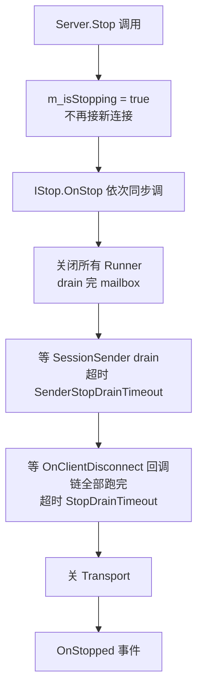

# 进阶话题

> English version: [advanced.md](../en/advanced.md)

本页收集"做业务时迟早会用到"的进阶能力：Filter 管线、SessionManager、Broadcast、优雅停机、Kick、请求/心跳超时。

## Filter 管线

### 接口

```csharp
// Frameworks/Core/Interfaces/IFilter.cs
public interface IFilter
{
    void OnRegistered(IFilterable filterable);
    void OnClientConnected(uint clientId);
    void OnClientDisconnected(uint clientId);

    bool OnPreSend(Package pack);   // C -> S；返回 true 即拦截
    void OnPostSend(Package pack);

    bool OnPreRecv(Package pack);   // S -> C；返回 true 即拦截
    void OnPostRecv(Package pack);

    void OnError(uint clientId, Exception err);
}
```

### 典型场景

1. **日志**：抓所有进出包，打到结构化日志。
2. **心跳 / Idle 检测**：服务端踢长时间无流量的连接。
3. **鉴权拦截**：没登录时除了登录 route 之外的包一律拦下（搭配 `[BeforeLogin]`）。
4. **限流 / 熔断**：按 route 或 clientId 统计 QPS，超标拦截。
5. **审计追踪**：记录每个 Request 的 Id 与处理耗时。

### 注册

```csharp
server.RegisterFilter(new LoggerFilter());
server.RegisterFilter(new IdleClearFilter());
```

内置样例：

- [`Demo.Common/LoggerFilter.cs`](../../Frameworks/Demo/Demo.Common/LoggerFilter.cs) —— 最简单的日志打印。
- 模板里的 `Main/IdleClearFilter.cs` / `Main/LoggerFilter.cs`。
- [`Frameworks/Core/Filters/HeartbeatFilter.cs`](../../Frameworks/Core/Filters/HeartbeatFilter.cs) —— 框架默认就会挂，负责统计心跳时间。

### 执行顺序

- 服务端：`Transport → PreRecv filters → Processor Runner → Return Package → PreSend filters → Transport`。
- 客户端的 filter 注册入口在 `Client.Filterable.cs` 里，接口一致。

## SessionManager

每个 clientId 在服务端有一份**键值对状态**，类型是 Protobuf `IMessage`：

```csharp
// Frameworks/Server/SessionManagers/ISessionManager.cs
public interface ISessionManager
{
    T Get<T>(uint clientId, string key) where T : class, IMessage;
    void Set<T>(uint clientId, string key, T value) where T : class, IMessage;
    void Remove(uint clientId, string key);
    Dictionary<string, IMessage> GetAll(uint clientId);
    Dictionary<string, IMessage> GetAllPrefix(string prefix);
    Dictionary<string, IMessage> GetAllSuffix(string suffix);
}
```

Processor 里通过 `Server.SessionManager` 访问：

```csharp
[Request("login")]
public LoginResp Login(Header header, LoginReq req)
{
    var info = VerifyCredentials(req);
    Server.SessionManager.Set<LoginInfo>(header.ClientId, "login", info);
    return new LoginResp { ... };
}

[Request("profile")]
public ProfileResp GetProfile(Header header, Empty _)
{
    var info = Server.SessionManager.Get<LoginInfo>(header.ClientId, "login");
    if (info == null) throw new ProcessorMethodException(StatusCode.Failed, "NOT_LOGIN");
    ...
}
```

Session 在 `OnClientConnect` 时创建、`OnClientDisconnect` 时清理；清理钩子对每个 Processor 独立 try/catch，单个失败不阻塞其它。

## `[BeforeLogin]` 拦截语义

登录前 client 能调的 route 应该是极少数（登录本身、匿名握手接口等）。用 `[BeforeLogin]` 白名单：

```csharp
[BeforeLogin]
[Request("login")]
public LoginResp Login(Header header, LoginReq req) { ... }

// 未标 [BeforeLogin]：未登录客户端调这里会被框架拦截
[Request("shop.buy")]
public BuyResp Buy(Header header, BuyReq req) { ... }
```

实现是一个内置 filter：对每个 Request，检查 route 所在 method 是否有 `[BeforeLogin]`，否则要求 session 里已有登录标记才放行。业务可以自己覆写规则。

## Broadcast

跨 Processor、跨 clientId 的事件分发：

```csharp
// 生产者：任意线程都能调，框架内部用 ConcurrentQueue + 节流 drain
Server.Broadcast(header.ClientId, eventId: 42, data: new PlayerLeave { ... });

// 消费者：每个 Processor 都会收到，按自己意愿过滤/处理
public override bool IsRecognizeBroadcastEvent(int eventId) => eventId == 42;

public override Task OnBroadcast(uint clientId, int eventId, object data)
{
    // 在本 Processor Runner 线程执行，串行安全
    var leave = (PlayerLeave)data;
    ...
    return Task.CompletedTask;
}
```

- 事件投递**不保证跨 Processor 顺序一致**（ConcurrentQueue 逐 Processor 独立），但**单个 Processor 内部**维持 FIFO。
- 每 Runner 每个 tick 最多消费 `maxItems` 条，剩余留下轮；详见 [processor-model.md](./processor-model.md#broadcastprocessor-间广播事件)。

## 优雅停机

核心流程在 [Frameworks/Server/Server.cs](../../Frameworks/Server/Server.cs)：



关键机制：
- `m_isStopping` volatile 标记：`OnClientConnectEvent` 进来检查，直接踢掉 Stop 期间的新连接。
- `m_liveClients` 每连接一票：`TaskCompletionSource` 登记 → OnClientDisconnect 链全部跑完 `TrySetResult` → `Task.WhenAll` drain。
- 双重超时预算：Sender 2s、整体 drain 10s，防 k8s `terminationGracePeriodSeconds` 到点被 SIGKILL。

业务 Processor 想在停机时持久化数据，实现 `IStop.OnStop()`，例如：

```csharp
public class DbSaverProcessor : ProcessorBase, IStop
{
    public void OnStop()
    {
        FlushPendingWrites();   // 同步调用；drain 完成前不会返回
    }
}
```

## Kick（服务端主动踢人）

```csharp
Server.Kick(header.ClientId, reason: "BANNED");
```

实现：发一个 `PackageType.Kick` 包，`Status.Message = reason`；客户端收到后触发 `OnKicked(reason)` 回调并主动 `Disconnect`。相对直接 `Transport.DisconnectClient`，Kick 给了客户端一个"明确知道为什么被断"的机会。

## 请求超时

客户端侧：`Client.RequestTimeout`（默认 `5s`）。`TimeoutLoop` 周期检查 `m_requestCallbacks` 里所有 in-flight 请求，过期的 `OnResponse` 回传 `StatusCode.Timeout`（`Message = "REQUEST_TIMEOUT"`）。

```csharp
var client = new Client<NcClient>();
client.RequestTimeout = TimeSpan.FromSeconds(10);

var (status, resp) = await client.Echo_Timeout(new PbString{ Value = "x" });
if (status.Code == StatusCode.Timeout) { ... }
```

注意：`Timeout` 是**客户端本地**生成的，服务端不会发 `Response`；因此 `resp` 为 `null`。业务需要分三类：`Success` / `Failed`（业务错误）/ `Timeout` + `Error`（网络）。

## 心跳超时

客户端 `HeartbeatLoop`（[Frameworks/Client/Client.Heartbeat.cs](../../Frameworks/Client/Client.Heartbeat.cs)）：
- 周期 `Consts.HeartBeat.Update`（通常 1s）检查
- 每 `m_handshake.HeartBeatInterval`（服务端下发，默认约 3s）发一次 Ping
- 如果某个 Ping 的 Pong 迟到超过 `Consts.HeartBeat.Timeout`，抛 `HeartbeatTimeoutException` 并主动 `Disconnect`

实时 RTT 统计 `PingAvg / Min / Max / Count` 可以做客户端网络质量 UI。

## 并发与锁的心智模型

```text
客户端请求 ─┐
          ├─► 框架入站 Dispatch ─► ProcessorRunner.mailbox ─► Route.Invoke
ProcessorRef  ┘                             │
(跨 Processor 调用)                         │
                                              ▼
                                        一条 FIFO 邮箱
                                     (MaxConcurrency=1 时严格串行)
```

- **默认串行**：一个 Processor 只有一把"锁"，它的所有字段、所有路由方法天然互斥。
- **想提并发**：类标 `[MaxConcurrency(N)]`；方法如果不想全部放开，再用方法级 `[MaxConcurrency(M)]`。此时你必须自己保证字段并发安全（或用 `ConcurrentDictionary`）。
- **别直接持裸对象**：跨 Processor 必须通过 `Server.GetProcessor<T>()` + `[ProcessorApi]`，否则静态分析器会报。

## 调试与观测

- 启动时打印 route 表：`Server.OnStarted` 事件里 `foreach (var p in Server.Processors) ...`。
- 运行时看 Runner 状态：`Server.GetProcessorQueueStatus()` 返回每个 Runner 的 queue / broadcast peak。
- 发送队列：`Server.IsSendQueueFull` / `Server.SendQueueCount` / `Server.GetAllSendQueue()`。
- Client 心跳：`PingAvg / Min / Max / Count`。
- UnitTest 示例：[Frameworks/UnitTest/TestStopDrain.cs](../../Frameworks/UnitTest/TestStopDrain.cs)（优雅停机）、`TestMaxConcurrency.cs`、`TestDeferCall.cs`、`TestDelayCall.cs`。
