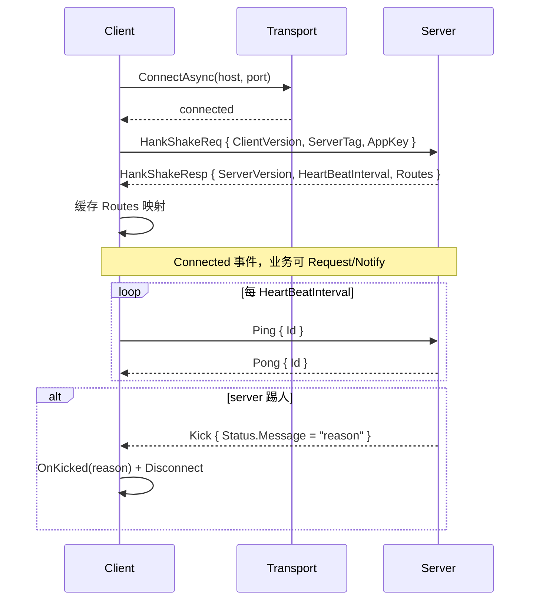

# 客户端

> English version: [clients.md](../en/clients.md)

GoPlay 官方维护 3 种客户端：C#（桌面、Unity）、TypeScript（Web / Node / 小程序）、JavaScript（免构建的纯浏览器）。三端遵循同一份 wire protocol（详见 [protocol.md](./protocol.md)），Handshake / Heartbeat / Request / Notify / Push 语义一致。

## C# 客户端（`GoPlay.Client`）

### 安装

```bash
dotnet add package GoPlay.Client
# 外加一个 Transport
dotnet add package GoPlay.Core.Transport.NetCoreServer   # 或 Transport.Ws / Transport.Wss
```

TargetFramework：`net7.0;net8.0;net9.0;net10.0;netstandard2.1`（最后一个给 Unity）。

### 基本用法

```csharp
using GoPlay;
using GoPlay.Core.Transport.NetCoreServer;
using GoPlay.Core.Protocols;

var client = new Client<NcClient>();
client.OnConnected    += () => Console.WriteLine("Connected");
client.OnDisconnected += () => Console.WriteLine("Disconnected");
client.OnError        += err => Console.WriteLine($"Err: {err}");
client.OnKicked       += reason => Console.WriteLine($"Kicked: {reason}");

await client.Connect("localhost", 8888);

// Request - 等回包
var (status, resp) = await client.Request<PbString, PbString>("echo.request",
                                                              new PbString { Value = "Hi" });

// Notify - 不等回包
client.Notify("echo.notify", new PbString { Value = "Hi" });

// 订阅 Push
client.AddListener<PbString>("echo.push", data =>
    Console.WriteLine($"push: {data.Value}"));

// 或者一次性等 Push
var pushed = await client.WaitFor<PbString>("echo.push");
```

如果服务端跑过了 `goplay extension`，上面的 `Request<,>` 字符串调用都可以写成强类型扩展：

```csharp
var (status, resp) = await client.Echo_Request(new PbString { Value = "Hi" });
client.Echo_Notify(new PbString { Value = "Hi" });
```

### 主要成员

- `Connect(host, port, timeout?)`：握手 + 建 send/recv loop；失败时返回 `false` 且触发 `OnError`。
- `Disconnect()` / `DisconnectAsync()`：主动断线。
- `Request<T, TR>(route, data)` / `Request<TR>(route)` / `Request<T>(route, data)` / `Request(route)`：4 个重载，按需要传入/返回类型。
- `Notify<T>(route, data)` / `Notify(route)`：发通知。
- `AddListener<T>(route, Action<T>)` / `AddListenerOnce` / `RemoveListener`：Push 订阅。
- `WaitFor<T>(route)`：返回 `Task<T>`，等下一个匹配 route 的 Push。
- `MainThreadActionRunner`：见下文 Unity 小节。
- 心跳统计：`PingAvg` / `PingMax` / `PingMin` / `PingCount`。

### Unity / 主线程回调

Unity 里 UI / GameObject 只能在主线程操作。框架为此提供 `MainThreadActionRunner`：

```csharp
public interface IMainThreadActionRunner
{
    void Invoke(Action action);
}
```

默认实现是直接在回调线程 `action()`。Unity 里把它换成自己的 `UnitySynchronizationContext` 封装即可：

```csharp
client.MainThreadActionRunner = new UnityMainThreadActionRunner();
```

换完以后 `OnConnected` / `OnDisconnected` / `OnError` / `AddListener` 回调都会切回主线程。

### 断线重连

目前 `Client` 不内建自动重连策略，但 API 组合很简单：

```csharp
async Task Loop()
{
    while (!stop)
    {
        if (client.Status == Client.ClientStatus.Disconnected)
        {
            try { await client.Connect(host, port); }
            catch { /* ignore, retry */ }
        }
        await Task.Delay(1000);
    }
}
```

## TypeScript 客户端（`goplay-ws`）

WebSocket + Protobuf（protobufjs）实现，源码位于 [Clients/Typescript/](../../Clients/Typescript/)。

### 安装

```bash
npm install goplay-ws
```

### 基本用法

```ts
import goplay from 'goplay-ws';
import { GoPlay } from 'goplay-ws/dist/pkg.pb';   // 协议类型

goplay.on(goplay.Consts.Events.CONNECTED,    () => console.log('connected'));
goplay.on(goplay.Consts.Events.DISCONNECTED, () => console.log('disconnected'));
goplay.on(goplay.Consts.Events.ERROR,        err => console.log('err', err));
goplay.on(goplay.Consts.Events.KICKED,       reason => console.log('kicked', reason));

await goplay.connect('ws://127.0.0.1:8888');

// Request
const req = new GoPlay.Core.Protocols.PbString();
req.Value = 'hello';
const resp: any = await goplay.request(
    'echo.request', req,
    GoPlay.Core.Protocols.PbString,   // 结果类型
);
console.log(resp.status.Code, resp.data.Value);

// Notify
goplay.notify('echo.notify', req);

// Push
goplay.onType('echo.push', GoPlay.Core.Protocols.PbString, (data: any) => {
    console.log('push', data.Value);
});
```

完整运行样例见 [Clients/Typescript/unit_test/e2e/goplay.Request.test.ts](../../Clients/Typescript/unit_test/e2e/goplay.Request.test.ts)。

### 关键 API（来自 [goplay.ts](../../Clients/Typescript/src/goplay.ts)）

- `goplay.connect(url) / goplay.disconnect()`
- `goplay.request<T, RT>(route, data, resultType)`
- `goplay.notify<T>(route, data)`
- `goplay.onType<T>(event, type, fn)` / `goplay.onceType<T>(...)`
- `goplay.on / once / off / removeAllListeners`（基于内置 Emitter 的事件总线）
- Filter pipeline：`sendFilters` / `recvFilters` / `errorFilters` 注入中间件（源码已预留）

TypeScript 端也有**发送队列背压**：`HIGH_WATERMARK = 1 MiB`，达到水位后走 `drainTimer`（16 ms 周期）冲 ws.bufferedAmount，不会在 `send()` 里死等。

### 跨环境

- **浏览器**：直接 `import goplay from 'goplay-ws'`，包内自动用 `window.WebSocket`。
- **Node.js**：包内自动 fallback 到 `ws` 模块。
- **小游戏 / 微信**：由于引擎各有差异，建议参考 `src/goplay.ts` 里的 `WebSocket` 兼容切面，自行替换。

## JavaScript 客户端（纯 JS）

位置：[Clients/Javascript/goplay.client.js](../../Clients/Javascript/goplay.client.js) + [protobuf.min.js](../../Clients/Javascript/protobuf.min.js)。

适合"把几个 JS 塞进 HTML 就能用"的场景 —— 不需要 npm / webpack / ts。语义与 TypeScript 版一致，API 略微老一些（保持兼容不做大改）。

```html
<script src="protobuf.min.js"></script>
<script src="long_umd_v5.2.3.js"></script>
<script src="pkg.pb.js"></script>
<script src="pb.helpers.js"></script>
<script src="goplay.client.js"></script>
<script>
    goplay.connect('ws://127.0.0.1:8888', async () => {
        const resp = await goplay.request('echo.request', { Value: 'hi' });
        console.log(resp);
    });
</script>
```

浏览器 demo：[Clients/Javascript/demo/](../../Clients/Javascript/demo/)。

## Handshake 时序（所有客户端通用）



- Request / Response 靠 `Id` 对齐，详见 [protocol.md](./protocol.md)。
- Route 字符串 → uint 映射是一次性在 Handshake 拿到的，业务代码里可以随意用字符串（框架会 O(1) 查表）。
- Pong 迟到超过阈值触发 `HeartbeatTimeoutException`，客户端主动断。
