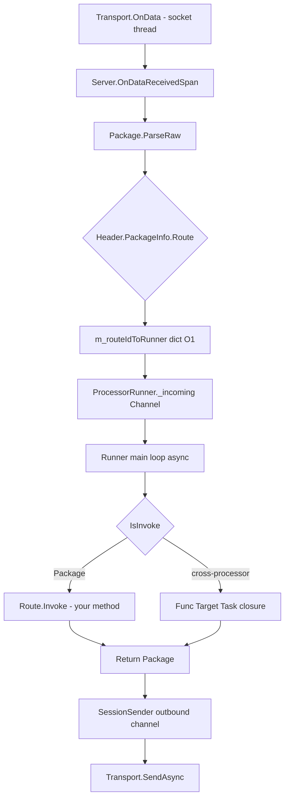

# Processor-Actor 模型

> English version: [processor-model.md](../en/processor-model.md)

GoPlay 最独特的设计点是：**每个 Processor 是一个 Actor**，由独占的 `ProcessorRunner` 串行驱动 mailbox，业务代码无需加锁；跨 Processor 调用通过 `ProcessorRef` 投递闭包，天然消除数据竞争。本文详细解释这套模型。

## 概念边界

- **Processor**（[Frameworks/Server/Processors/Base/ProcessorBase.cs](../../Frameworks/Server/Processors/Base/ProcessorBase.cs)）：业务类，继承 `ProcessorBase`，标 `[Processor("name")]`。长驻对象，生命周期覆盖整个服务器进程。
- **ProcessorRunner**（[Frameworks/Server/Processors/ProcessorRunner.cs](../../Frameworks/Server/Processors/ProcessorRunner.cs)）：每个 Processor 独占一个 Runner，内部有单 reader 的 `Channel<RunnerWorkItem>` 邮箱，主循环 async 化。
- **ProcessorRef**（[Frameworks/Server/Processors/ProcessorRef.cs](../../Frameworks/Server/Processors/ProcessorRef.cs)）：跨 Processor 调用句柄，`readonly struct`，0 堆分配。

## 分发路径



关键点：
- **路由 O(1)**：`Dictionary<uint, ProcessorRunner>` 在 `BuildRouteMap` 一次建好。
- **串行语义**：默认 `MaxConcurrency=1`，Runner 里同一时刻只有一个 work item 在跑；业务代码不需要加锁访问 Processor 字段。
- **FIFO 公平**：外部请求（Package）与跨 Processor 闭包（`Work`）共享同一条 mailbox，按入队顺序串行执行。

## ProcessorBase：Processor 能做什么

```csharp
[Processor("echo")]
public class EchoProcessor : ProcessorBase, IStart, IStop, IUpdate
{
    // 1. 路由方法：以 Attribute 注册到 route 表
    [Request("request")]
    public PbString Request(Header header, PbString data) { ... }

    [Notify("notify")]
    public void Notify(Header header, PbString data) { ... }

    // 2. 可推送 route 声明
    public override string[] Pushes => new[] { "echo.push" };

    // 3. 生命周期钩子
    public void OnStart() { }
    public void OnStop() { }
    public Task OnUpdate() { ... }
    public override void OnClientConnected(uint clientId) { }
    public override void OnClientDisconnected(uint clientId) { }

    // 4. 主动发包
    void Example(Header header)
    {
        Push("echo.push", header, new PbString { Value = "hi" });  // 对 header.ClientId 推送
        Return(header, new PbString { Value = "early return" });   // 提前返回 Response
    }

    // 5. 延迟 / 稍后执行
    void Schedule()
    {
        DeferCall(async () => { /* 投递到本 Runner 邮箱稍后执行 */ });
        DelayCall(TimeSpan.FromSeconds(3), async () => { /* 3s 后执行 */ });
    }
}
```

### 方法签名约定

- `[Request("x")]` 返回**业务 Protobuf**（或 `Task<TProto>`），入参 `(Header, TProtoRequest)`。返回值会自动封装成 `Response` 包。
- `[Notify("x")]` 返回 `void` 或 `Task`，入参 `(Header, TProtoRequest)`。无回包。
- `Header` 必须是第一个参数。第二个参数可省（仅 route 本身有意义时）。
- 抛 `ProcessorMethodException(StatusCode.Failed, "CODE")` 可以回传业务错误；抛其它异常会走 `OnErrorEvent` 并回 `StatusCode.Error`。

### 生命周期钩子

- `IStart.OnStart`：服务器 `Start()` 时同步调用一次，在任何客户端连上之前。适合装载静态数据。
- `IStop.OnStop`：服务器 `Stop()` drain 完后同步调用一次，适合存盘。
- `IUpdate.OnUpdate`：Runner 周期 tick（默认 1 次/秒，可通过 `UpdateDeltaTime` 覆盖）调用。相当于 Unity 的 `Update`，用于周期巡检。
- `OnClientConnected(uint clientId)` / `OnClientDisconnected(uint clientId)`：每个 Processor 都会收到，**独立 try/catch**：单个 Processor 抛异常不会吞掉其它 Processor 的事件。

## 并发控制：三级覆盖

```text
Server(defaultConcurrency)             ← 构造时默认值（<=0 则等于 Environment.ProcessorCount）
      │
      ▼
[MaxConcurrency(N)] on class           ← 覆盖 server 默认值，作为 Processor 总闸
      │
      ▼
[MaxConcurrency(N)] on method          ← 方法级别闸门，N 必须 <= Processor 总闸
```

声明处：[Frameworks/Core/Attributes/MaxConcurrencyAttribute.cs](../../Frameworks/Core/Attributes/MaxConcurrencyAttribute.cs)。

### 典型配置

```csharp
// 全服务器默认：每 Processor 最多 CPU 核心数 in-flight
var server = new Server<NcServer>(Environment.ProcessorCount);

[MaxConcurrency(1)]          // 严格串行（对老业务完全兼容）
[Processor("db")]
class DbSaverProcessor : ProcessorBase
{
    [MaxConcurrency(4)]      // ❌ 编译或启动期报错：方法级不能大于类级
    [Request("save")]
    public async Task<PbBool> Save(Header h, UserData d) { ... }
}

[MaxConcurrency(8)]
[Processor("match")]
class MatchProcessor : ProcessorBase
{
    [MaxConcurrency(2)]      // ✅ 2 ≤ 8，合法
    [Request("joinRoom")]
    public async Task<Room> JoinRoom(Header h, JoinReq r) { ... }
}
```

- `MaxConcurrency == 1`：严格串行，无需加锁，性能次优但最安全。
- `MaxConcurrency > 1`：底层用 `ExclusiveScheduler` + `SemaphoreSlim` 限制同步段并发。此时**业务字段如果会在多路并行 await 之间访问，需要自己保证线程安全**。
- 静态分析器 `Analyzer.MaxConcurrency` 会在编译期帮你检查非法配置。

## 跨 Processor 调用：ProcessorRef

直接持有别的 Processor 对象（`Server.GetProcessorUnsafe<T>()`）会**绕过 mailbox 串行语义**，造成跨 Runner 数据竞争 —— 这条逃生通道**已标 `[Obsolete]`**，仅为迁移期保留。

推荐用法：

```csharp
// 目标 Processor：把要暴露给外部的方法标 [ProcessorApi]
[Processor("db")]
public class DbSaverProcessor : ProcessorBase
{
    [ProcessorApi]
    public async Task<PbBool> SaveUser(uint userId, UserData data) { ... }

    [ProcessorApi(Fire = true)]      // fire-and-forget
    public async Task LogEvent(string evt) { ... }
}

// 调用方 Processor：通过 GetProcessor<T>() 拿到 Ref，直接调同名扩展方法
[Processor("game")]
public class GameProcessor : ProcessorBase
{
    [Request("doSomething")]
    public async Task<PbBool> DoSomething(Header header, ReqX data)
    {
        var ok = await Server.GetProcessor<DbSaverProcessor>()
                               .SaveUser(header.ClientId, ...);
        Server.GetProcessor<DbSaverProcessor>().LogEvent("done");
        return ok;
    }
}
```

### 编译期生成扩展方法

`Tools/Generator.ProcessorRef` 是一个 Roslyn **源生成器**，扫描所有 `[ProcessorApi]` 方法，为每个生成一个 `ProcessorRef<T>` 的同名扩展：

```csharp
// 自动生成
public static Task<PbBool> SaveUser(this ProcessorRef<DbSaverProcessor> self, uint userId, UserData data)
    => self.Request(p => p.SaveUser(userId, data));

public static void LogEvent(this ProcessorRef<DbSaverProcessor> self, string evt)
    => self.Notify(p => p.LogEvent(evt));
```

业务侧看到的就是一次普通的 `await` 调用。

### 运行时语义

- **Request**（返回 `Task<T>` 或 `Task`）：把闭包投递到目标 mailbox，等结果；异常经 awaiter 重新抛出。
- **Notify**（`Fire=true` 或 `void` 返回）：fire-and-forget，异常就地走 `Server.OnErrorEvent`，永不逃逸。
- **回环 inline**：调用方和目标是**同一个 Runner** 时（自己调自己），`Request` 直接内联执行 `fn(Target)`，避免 mailbox 自等死锁；`Notify` 仍入队。

## DeferCall / DelayCall

这两个是 Processor 给业务的"**在本 Runner 稍后执行**"入口。

```csharp
void Example()
{
    DeferCall(async () => {
        // 投递到本 Runner 邮箱，串行执行；和客户端请求共排一队
    });

    DelayCall(TimeSpan.FromSeconds(5), async () => {
        // 5 秒后在本 Runner 上执行一次
    });
}
```

- 两者都**线程安全**：跨 Runner 调用时会走 `Runner.Post` 再进入目标 Runner，不会撕裂 `m_delayTasks` 列表。
- `DelayCall` 的到期检查挂在 Runner 的周期 tick 里；精度为 tick 粒度（默认 ~1s）。

## Broadcast：Processor 间广播事件

- `Server.Broadcast(clientId, eventId, data)` 把 `(clientId, eventId, object)` 入所有 Processor 的 `_broadcastQueue`。
- Runner 每个周期 tick 会 `ResolveBroadCast` 调用 `Processor.OnBroadcast`，**单次最多消费 maxItems 条**，剩余留给下一轮。防止广播洪峰把 Runner tick 独占、饿死 `Update` / `DeferCall` / `DelayCall`。
- Processor 可以 override `IsRecognizeBroadcastEvent(eventId)` 提前过滤。

## 典型模式

### 模式一：每请求串行的业务 Processor

```csharp
[Processor("match")]
public class MatchProcessor : ProcessorBase
{
    private readonly Dictionary<uint, Room> _rooms = new();   // 无锁访问，Runner 串行保护

    [Request("join")]
    public async Task<JoinResp> Join(Header h, JoinReq req)
    {
        _rooms.TryGetValue(req.RoomId, out var room) // 无并发问题
        ...
    }
}
```

### 模式二：DB 访问并发限流

```csharp
[MaxConcurrency(16)]                                 // 16 条 in-flight SQL
[Processor("db")]
public class DbSaverProcessor : ProcessorBase
{
    [ProcessorApi]
    public async Task<int> SaveUser(uint userId, UserData d)
    {
        return await _dbPool.ExecuteAsync(...);      // 整个 Processor 并发上限 16
    }
}
```

### 模式三：业务封装 DelayCall

```csharp
[Request("quickBattle")]
public PbBool StartBattle(Header h, BattleReq req)
{
    // 3s 后无结果则广播胜利
    DelayCall(TimeSpan.FromSeconds(3), async () =>
    {
        if (IsResolved(h.ClientId)) return;
        Push("battle.finish", h, new BattleResult { Winner = h.ClientId });
    });
    return new PbBool { Value = true };
}
```

## 对比

### vs ET 的 Entity-Actor

| 维度 | ET | GoPlay |
|------|-----|--------|
| Actor 粒度 | 每 Entity（通常一个玩家）一个 Actor | 每 Processor（功能模块）一个 Actor |
| 玩家间互斥 | 天然（不同 Entity 不同 Actor） | 同一 Processor 内默认串行；跨玩家互斥由业务安排 |
| 跨 Actor 调用 | `ActorLocationSender` 发消息 | `Server.GetProcessor<T>()` + 源生成器扩展 |
| 状态存放 | Entity 里 | Processor 字段 / `SessionManager` |

ET 适合玩家为中心的 MMO；GoPlay 适合功能分层清晰的系统（大厅、匹配、战斗、DB 拆几个 Processor）。

### vs Orleans 的 Grain

| 维度 | Orleans | GoPlay |
|------|---------|--------|
| 激活策略 | 按需激活 / 回收（Virtual Actor） | 启动时 Register，进程周期长驻 |
| 调用入口 | `GrainFactory.GetGrain<T>(key)` | `Server.GetProcessor<T>()` |
| 分布式 | 内建，支持位置透明 | 当前仅单机；集群模式 TO-DO |
| 跨调用 | 接口声明 + 代码生成 proxy | `[ProcessorApi]` + Roslyn 源生成器 |
| 并发粒度 | Grain 内串行 | Processor 内串行，`[MaxConcurrency]` 可调 |

GoPlay 的 Processor 更接近"长驻的、强类型的、配置化并发度的 Grain"。

## 调试与观测

- `Server.GetProcessorQueueStatus()` 返回 `IEnumerable<ProcessorStatus>`，可以看到每个 Runner 的 queue depth、broadcast peak depth。
- 单元测试参考 [Frameworks/UnitTest/TestMaxConcurrency.cs](../../Frameworks/UnitTest/TestMaxConcurrency.cs)、`TestDeferCall.cs`、`TestDelayCall.cs`，三份都是 Runner 行为的官方断言。
